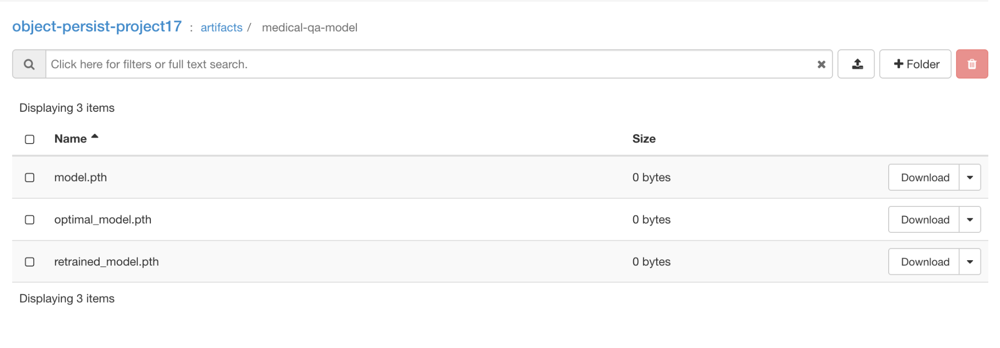
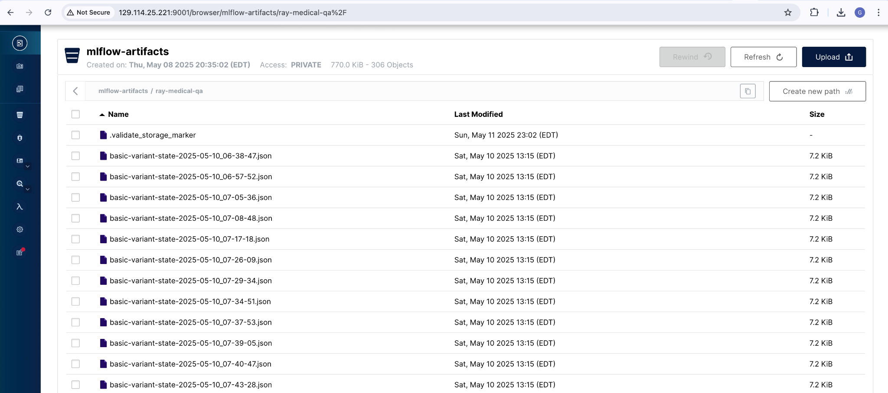
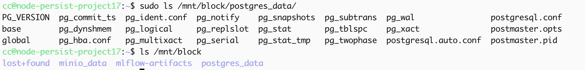
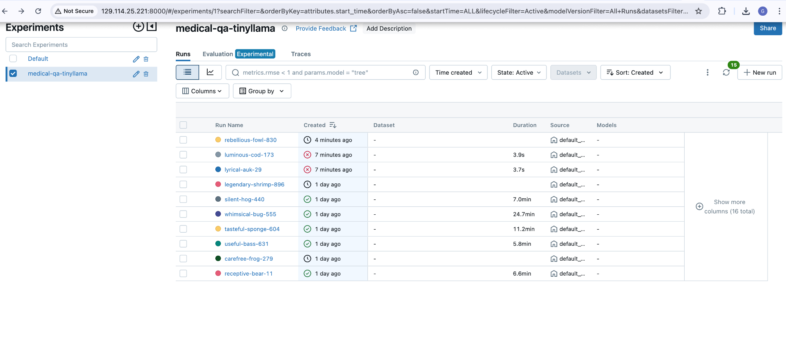
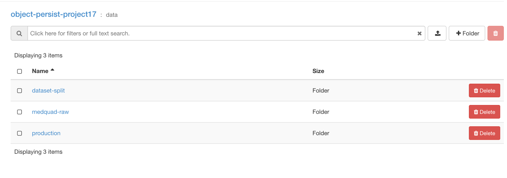
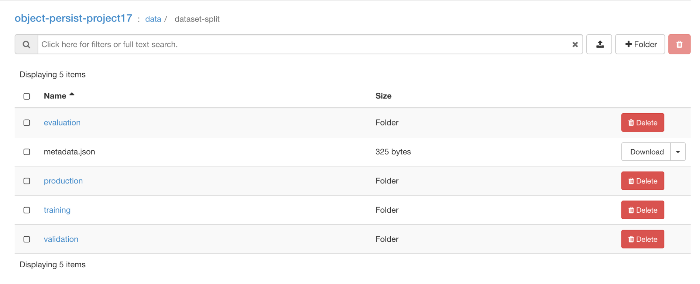
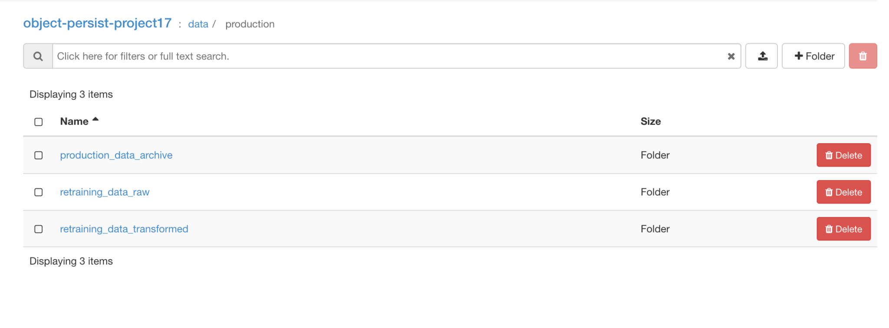
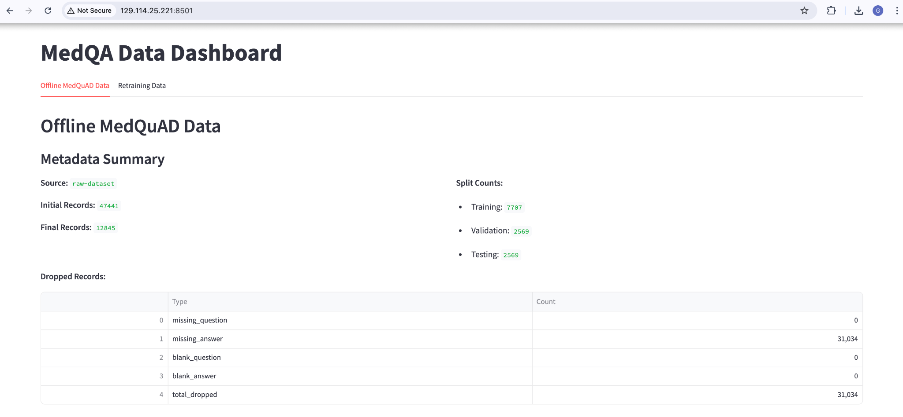

# Medical Chatbot MLOps Project (my Contributions)

This document summarizes my contributions to the Medical Chatbot MLOps project, in alignment with the course requirements.

---

## Persistent Storage

**Requirement:** Provision persistent storage (block and object) on Chameleon Cloud to store all project-related artifacts.

### My Implementation:

- **Object Storage**:

  - **Tool**: `rclone`, MinIO
  - **Location**: All offline and retraining data are stored in Chameleon’s object store at `chi@tacc`.
  - **Buckets Created**:
    - `/mnt/object/data/dataset-split/` – Contains offline training and validation data.
    - `/mnt/object/data/production/retraining_data_raw/` – Contains raw logs and production data.
    - `/mnt/object/data/production/retraining_data_transformed/` – Contains transformed production data used for retraining.
    - `/mnt/object/artifacts/minio_data/` – Stores all MLflow artifacts, including metrics and model checkpoints.
    - `/mnt/object/artifacts/medical-qa-model/` – Stores only the best model checkpoints selected from training.

  
  
  

- **Block Storage (KVM @ TACC)**:

  - Provisioned volume and mounted on `/mnt/block`.
  - **Service Using It**: MLflow experiment tracking stores the backend database and artifact metadata here.

- **Scripts Provided**:
  - `scripts/block_mount.sh`
  - `scripts/object_mount.sh`
  - `scripts/kvm_setup.ipynb`

  

- **MLflow UI**: [http://129.114.25.221:8000/](http://129.114.25.221:8000/)
  

---

## Offline Data

**Requirement:** Manage training and validation datasets, transform into appropriate format, and store in object repository.

### My Implementation:

- **Dataset Used**: `lavita/MedQuAD` from HuggingFace

- **ETL Pipeline (Docker-based)**:
  - Extract, Transform, Load
  - Tools: Python, Docker Compose, Bash

- **Files Provided**:
  - `data_preprocessing.py`
  - `docker/docker-compose-etl.yaml`
  - `scripts/run_etl.sh`
  - `requirements.txt`, `Dockerfile`

- **Data Lineage & Sample**:
  ```json
  {
    "question": "What are the symptoms of asthma?",
    "answer": "Asthma symptoms include shortness of breath, wheezing, and chest tightness."
  }
  ```

  
  

---

## Data Pipeline (Retraining)

**Requirement:** Define pipeline for ingesting, cleaning, and transforming new production data for retraining.

### My Implementation:

- Directory: `/mnt/object/data/production/`
- Pipeline Flow: Extract → Transform → Archive
- Scripts: `retraining_data_transform.py`, `docker-compose-retraining-etl.yaml`, `run_retraining_etl.sh`

  

---

## Online Data & Simulation

- **Script**: `simulate_online_data.py`
- Sends simulated QA requests for inference and stores responses for retraining

---

## Interactive Data Dashboard

- **Tool**: Streamlit + Plotly
- **Dashboard UI**: [http://129.114.25.221:8501/](http://129.114.25.221:8501/)
- **Files**: `dashboard.py`, `docker-compose-dashboard.yaml`

  

---

## GitHub Repository Structure

```
geetha/
├── dashboard.py
├── data_preprocessing.py
├── retraining_data_transform.py
├── simulate_online_data.py
├── version_tracker.txt
├── requirements.txt
├── Dockerfile
│
├── docker/
│   ├── docker-compose-etl.yaml
│   ├── docker-compose-retraining-etl.yaml
│   ├── docker-compose-dashboard.yaml
│   ├── docker-compose-persistant-storage.yaml
│
├── scripts/
│   ├── block_mount.sh
│   ├── object_mount.sh
│   ├── run_etl.sh
│   ├── run_retraining_etl.sh
│   └── kvm_setup.ipynb
```
