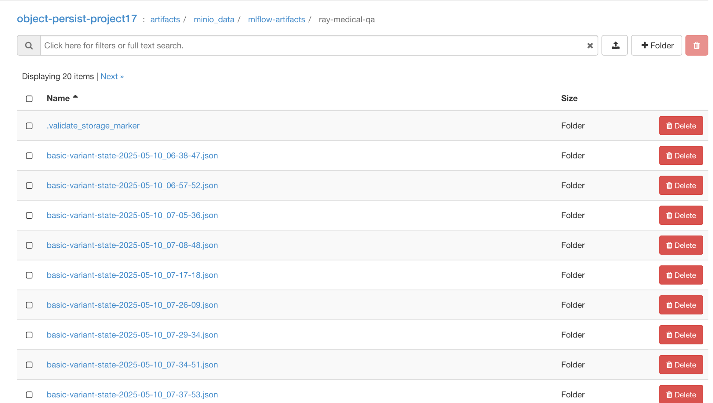

# Medical Chatbot MLOps Project (my Contributions)

This document summarizes my contributions to the Medical Chatbot MLOps project, in alignment with the course requirements.

---

## Persistent Storage

**Requirement:** Provision persistent storage (block and object) on Chameleon Cloud to store all project-related artifacts.

### My Implementation:

- **Object Storage**:

  - **Tool**: `rclone`, MinIO
  - **Location**: All offline and retraining data are stored in Chameleon’s object store at `chi@tacc`.
  - **Buckets Created**:
    - `/mnt/object/data/dataset-split/` – Contains offline training and validation data.
    - `/mnt/object/data/production/retraining_data_raw/` – Contains raw logs and production data.
    - `/mnt/object/data/production/retraining_data_transformed/` – Contains transformed production data used for retraining.
    - `/mnt/object/artifacts/minio_data/` – Stores all MLflow artifacts, including metrics and model checkpoints.
    - `/mnt/object/artifacts/medical-qa-model/` – Stores only the best model checkpoints selected from training.

  
  
  

- **Block Storage (KVM @ TACC)**:

  - Provisioned volume and mounted on `/mnt/block`.
  - **Service Using It**: MLflow experiment tracking stores the backend database and artifact metadata here.
  - **Compose Config**:
    - [`docker-compose-persistant-storage.yaml`](https://github.com/phoenix1881/Medical-Chatbot-MLOps/blob/main/Geetha/docker/docker-compose-persistant-storage.yaml)
  - **Scripts Provided**:
    - [`block_mount.sh`](https://github.com/phoenix1881/Medical-Chatbot-MLOps/blob/main/Geetha/scripts/block_mount.sh)
    - [`object_mount.sh`](https://github.com/phoenix1881/Medical-Chatbot-MLOps/blob/main/Geetha/scripts/object_mount.sh)
    - [`kvm_setup.ipynb`](https://github.com/phoenix1881/Medical-Chatbot-MLOps/blob/main/Geetha/scripts/kvm_setup.ipynb)

  

- **MLflow UI**: [http://129.114.25.221:8000/](http://129.114.25.221:8000/)
  

---

## Offline Data

**Requirement:** Manage training and validation datasets, transform into appropriate format, and store in object repository.

### My Implementation:

- **Initial Training Transformations**:
    - **Field Selection**: Retain only essential fields: `question`, `answer`, `question_type`, `question_focus`, `synonyms`
    - **Cleaning Steps**:
        - Remove rows with missing or empty questions/answers
        - Normalize whitespace and trim leading/trailing spaces
    - **Filtering**:
        - Discard entries where `question_type` is not in the allowed set: `factoid`, `yesno`, `list`
        - This ensures uniformity in the training samples and reduces noise
    - **Final Output**:
        - Convert the cleaned data into three logical groups:
            - Training set (~60%) for model fitting
            - Validation set (~20%) for tuning and early stopping
            - Remaining data (~20%) reserved for future retraining or simulation
        - Stored as JSON files compatible with HuggingFace `datasets` and PyTorch DataLoader

- **Dataset Used**: `lavita/MedQuAD` from HuggingFace

- **ETL Pipeline (Docker-based)**:
  - Extract, Transform, Load using:
    - [`data_preprocessing.py`](https://github.com/phoenix1881/Medical-Chatbot-MLOps/blob/main/Geetha/data_preprocessing.py)
    - [`docker-compose-etl.yaml`](https://github.com/phoenix1881/Medical-Chatbot-MLOps/blob/main/Geetha/docker/docker-compose-etl.yaml)
    - [`run_etl.sh`](https://github.com/phoenix1881/Medical-Chatbot-MLOps/blob/main/Geetha/scripts/run_etl.sh)

- **Tools**: Python, Docker Compose, Bash

- **Data Lineage & Sample**:
  ```json
  {
    "question": "What are the symptoms of asthma?",
    "answer": "Asthma symptoms include shortness of breath, wheezing, and chest tightness."
  }
  ```

  
  

---

## Data Pipeline (Retraining)

- **Retraining Transformations**:
    - Parse all new `.json` logs from the `retraining_data_raw` folder
    - Extract required fields: `question`, `model_response`
    - Drop non-relevant fields like `symptoms`, `timestamp`, and other metadata
    - Filter out rows where required fields are missing or malformed
    - Combine cleaned rows into a new `retraining_data.json` under a versioned folder (e.g., `v1`, `v2`)
    - Archive processed raw logs in the corresponding `production_data_archive/vN/` folder to prevent reprocessing

**Requirement:** Define pipeline for ingesting, cleaning, and transforming new production data for retraining.

- **Directory Structure:**

  ```
  /mnt/object/data/production/
  ├── retraining_data_raw/
  ├── retraining_data_transformed/
  ├── production_data_archive/
  ```

- **Scripts**:
  - [`retraining_data_transform.py`](https://github.com/phoenix1881/Medical-Chatbot-MLOps/blob/main/Geetha/retraining_data_transform.py)
  - [`docker-compose-retraining-etl.yaml`](https://github.com/phoenix1881/Medical-Chatbot-MLOps/blob/main/Geetha/docker/docker-compose-retraining-etl.yaml)
  - [`run_retraining_etl.sh`](https://github.com/phoenix1881/Medical-Chatbot-MLOps/blob/main/Geetha/scripts/run_retraining_etl.sh)

  

---

## Online Data & Simulation

**Requirement:** Simulate online data streaming using real dataset to mimic real-world inference requests.

- **Simulation Dataset**:  
  I initially set aside **20% of the MedQuAD dataset** as unseen data, which was not used during training or validation. This subset was further divided into multiple production sets (`set1`, `set2`, etc.).

- **Simulation Strategy**:
  - Each production set mimics daily usage by users in a real medical QA system.
  - I simulate patient queries arriving sequentially by iterating through the production JSON records.
  - Each request is sent with an artificial delay to the FastAPI inference endpoint to simulate real time data.
  - The responses are logged and synced back to the object store for retraining.

- **Script**: [`simulate_online_data.py`](https://github.com/phoenix1881/Medical-Chatbot-MLOps/blob/main/Geetha/simulate_online_data.py)

- **Output Example**:
  ```json
  {
    "timestamp": "2025-05-10T13:00:00Z",
    "question": "Can children have asthma symptoms?",
    "model_response": "Yes, children can experience symptoms like coughing and wheezing."
  }
  ```

---

## Interactive Data Dashboard

- **Tool**: Streamlit + Plotly
- **Dashboard UI**: [http://129.114.25.221:8501/](http://129.114.25.221:8501/)
- **Script**: [`dashboard.py`](https://github.com/phoenix1881/Medical-Chatbot-MLOps/blob/main/Geetha/dashboard.py)

### What the Dashboard Displays

#### Tab 1: Offline MedQuAD Data
- QA Pair counts for training and validation sets
- Distribution of `question_type` using bar charts
- Histograms of question and answer word counts
- Metadata parsing from `metadata.json`
- Sample viewer with randomized examples

#### Tab 2: Retraining Data
- Automatically loads the latest versioned retraining dataset
- Displays number of QA records
- Histograms for both question and answer length
- Timestamp trends if available in production logs
- Flags malformed or incomplete entries

**Files**:
- [`docker-compose-dashboard.yaml`](https://github.com/phoenix1881/Medical-Chatbot-MLOps/blob/main/Geetha/docker/docker-compose-dashboard.yaml)
- [`requirements.txt`](https://github.com/phoenix1881/Medical-Chatbot-MLOps/blob/main/Geetha/requirements.txt)
- [`Dockerfile`](https://github.com/phoenix1881/Medical-Chatbot-MLOps/blob/main/Geetha/Dockerfile)


- **Dashboard UI**: [http://129.114.25.221:8501/](http://129.114.25.221:8501/)
- **Files**:
  - [`dashboard.py`](https://github.com/phoenix1881/Medical-Chatbot-MLOps/blob/main/Geetha/dashboard.py)
  - [`requirements.txt`](https://github.com/phoenix1881/Medical-Chatbot-MLOps/blob/main/Geetha/requirements.txt)
  - [`Dockerfile`](https://github.com/phoenix1881/Medical-Chatbot-MLOps/blob/main/Geetha/Dockerfile)
  - [`docker-compose-dashboard.yaml`](https://github.com/phoenix1881/Medical-Chatbot-MLOps/blob/main/Geetha/docker/docker-compose-dashboard.yaml)

  

