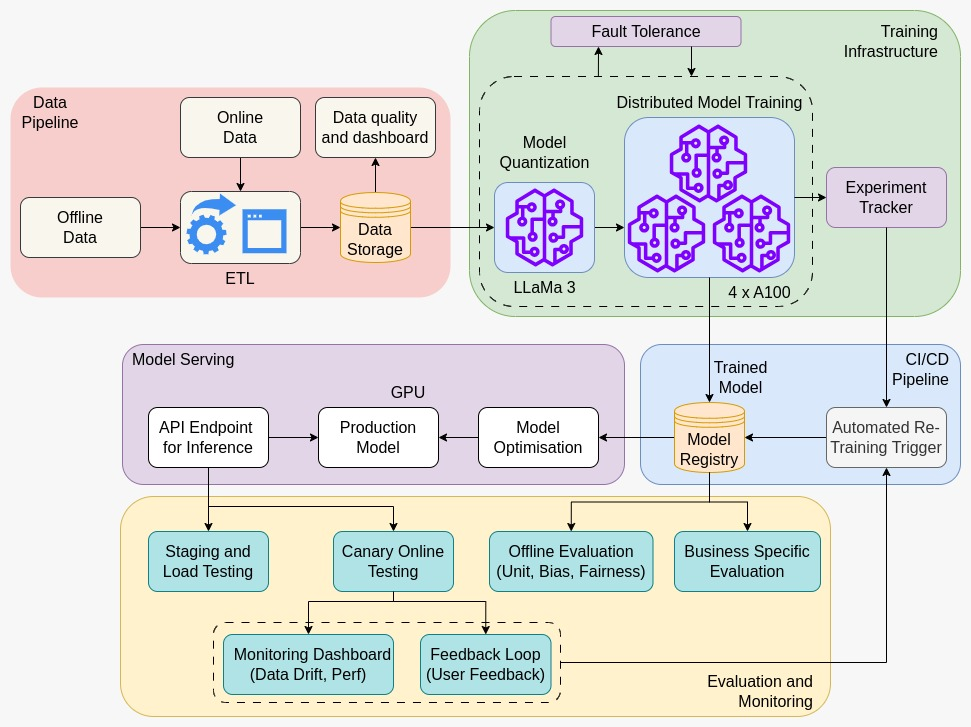

## Dr. Dialog: AI for Everyday Health Queries

### Value Proposition

#### Current Status Quo
Traditionally, initial patient assessments and triaging are performed manually by healthcare professionals, such as nurses or general practitioners. This conventional approach often leads to:

- **Extended wait times**: Patients experience delays before receiving initial advice.
- **High operational costs**: Manual triage demands significant human resources.
- **Variable guidance quality**: The consistency and depth of initial evaluations can vary.

#### Proposed ML System Advantages
Integrating the ML system into existing healthcare or telemedicine services brings several key improvements:

- **Efficiency and Speed**: Automated processing provides rapid, preliminary assessments based on a patient’s symptoms.
- **Consistency and Personalization**: Leverages a vast dataset and advanced models for consistent, tailored advice.
- **Cost-effectiveness**: Reduces reliance on manual triage, lowering operational costs.
- **Scalability**: Handles high volumes of queries, beneficial in peak or resource-constrained scenarios.

#### Business Metrics for Evaluation
Success for this ML system will be measured by:

- **Response Time**: Reduction in the average time to provide a preliminary answer.
- **Accuracy**: Precision in matching symptoms with likely conditions and suggesting appropriate next steps.
- **Patient Satisfaction**: Improvement in satisfaction scores, reflecting relevance and quality of guidance.
- **Operational Efficiency**: Reduction in manual triage workload and staffing costs.

#### Integration with Existing Services
The system is designed to plug into existing telemedicine or clinical support tools, enhancing current services without requiring new business models.

### Contributors

| Name                            | Responsible for                                         | Link to their commits in this repo |
|---------------------------------|---------------------------------------------------------|------------------------------------|
| All team members                | Project idea, value proposition, system design          |                                    |
| Raghu V Hemadri                 | Model Training & Infrastructure (Units 4 & 5)           |                                    |
| Tejdeep Chippa                  | Model Serving & Monitoring (Units 6 & 7)                |                                    |
| Vamsi UK Jonnakuti              | Data Pipeline (Unit 8)                                  |                                    |
| Geetha K Guruju                 | CI/CD, Deployment, Infra-as-Code (Unit 3)               |                                    |

### System diagram

The following diagram illustrates the architecture of our ML system, including all core components:

It includes:
- **Data Pipeline**: ETL from offline and online sources, data quality checks, and storage for training input.
- **Training Infrastructure**: Distributed model training using 4×A100 GPUs for LLaMa 3, with fault tolerance and experiment tracking.
- **CI/CD Pipeline**: Automates training and deployment using model registry and retraining triggers.
- **Model Serving**: Production model served via Flask API on GPU, with optional model optimization.
- **Evaluation & Monitoring**: Load testing, canary testing, offline evaluation (bias/fairness), monitoring dashboards, and user feedback loop.

### Summary of outside materials

|              | How it was created                                                  | Conditions of use                        |
|--------------|----------------------------------------------------------------------|------------------------------------------|
| ai-medical-dataset | Curated by ruslanmv, 21.2M QA pairs on Hugging Face            | CreativeML Open RAIL-M License           |
| MedQuAD      | NIH/NLM QA dataset                                                  | CC BY 4.0                                |
| GPT-2        | Pretrained on WebText by OpenAI                                     | Open for research and commercial use     |
| LLaMa 3.1 8B | Meta's open LLM fine-tuned with Ray + DDP on medical dataset        | Research use under Meta license          |

### Summary of infrastructure requirements

| Requirement     | How many/when                         | Justification                                         |
|-----------------|----------------------------------------|-------------------------------------------------------|
| `m1.medium` VMs | 2 for entire project duration          | Host API, dashboard, and monitoring                   |
| `gpu_a100`      | 1 node × 6 hrs/week for fine-tuning    | Train large-scale LLM efficiently                    |
| Floating IPs    | 1 for entire project duration          | Enable public access to services                      |
| Block storage   | 20 GB                                  | Dataset storage, logs, model artifacts                |
| MLflow Server   | 1 container                            | Experiment and performance tracking                   |

### Detailed design plan

#### Model training and training platforms

- **Unit 4**: Fine-tune LLaMa 3.1 8B using 4×A100 GPUs on medical QA dataset.
- **Unit 5**: Use Ray for distributed training; MLFlow for experiment tracking.
- **Extra Credit**: Fault tolerance, checkpointing, automated experiment management.

#### Model serving and monitoring platforms

- Serve model via Flask-based API on GPU.
- Optimize model using quantization.
- Monitor performance (latency, throughput, drift) with Prometheus + Grafana.
- Evaluate rollout performance using canary testing and feedback loops.

#### Data pipeline

- Offline and online data ingested and cleaned through ETL.
- Store QA pairs and online symptom input in centralized storage.
- Quality dashboard to monitor data integrity.

#### Continuous X

- Automated CI/CD pipeline triggers training and deployment.
- Canary and staging environments for controlled rollout.
- Model registry and feedback-driven retraining pipeline.
